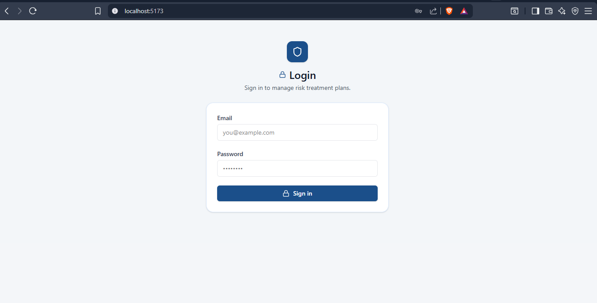
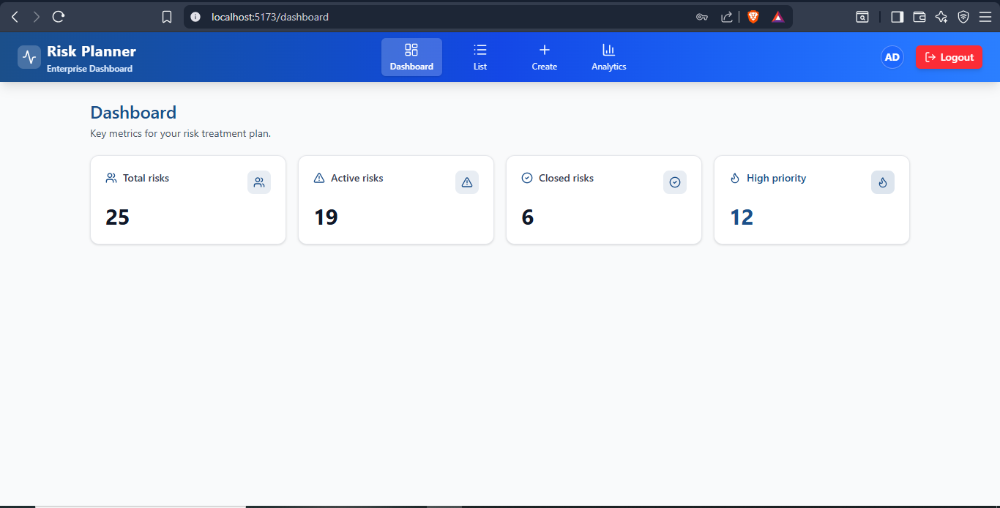
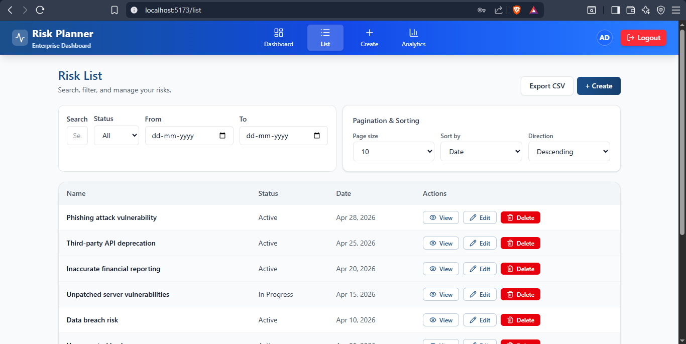
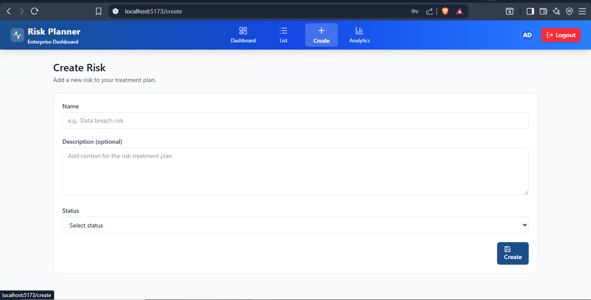
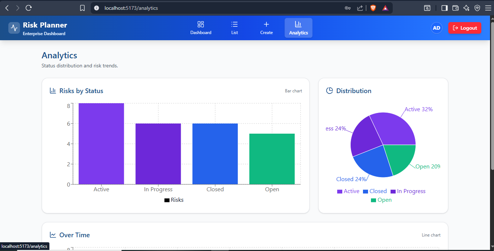

# 🛡️ Risk Treatment Planner

A modern, enterprise-grade, AI-powered risk management web application built using React. This project demonstrates full-stack integration readiness with a **robust mock fallback mechanism**, meaning the frontend remains fully functional, interactive, and demo-ready even when the backend is unavailable.

---

## 📸 Screenshots

### Login Page


### Dashboard Overview


### Risk List


### Create Risk


### Analytics Page


---

## 🚀 Key Features

### 🔐 Authentication & Security
- Secure login flow with JWT token handling.
- Protected routes to prevent unauthorized access.
- **Offline Mode:** Seamless mock login is available when the backend is down.

### 📋 Risk Management (CRUD)
- Complete functionality to **Create, Read, Update, and Delete** risks.
- Detailed risk view highlighting statuses, priorities, and historical metadata.
- Built-in safe-delete confirmation dialogs to prevent accidental data loss.

### 🤖 AI Integration (Mock + Ready)
- Dedicated AI intelligence panel inside the Risk Detail page.
- Integrates seamlessly with backend endpoints (`POST /describe`, `POST /recommend`).
- **Offline Mode:** Generates realistic, contextual mock AI responses when the backend is unreachable.

### 📊 Dashboard & Advanced Analytics
- **Dashboard KPIs:** Tracks Total Risks, Active Risks, Closed Risks, and High-Priority bottlenecks.
- **Visual Analytics:** Fully responsive interactive charts powered by **Recharts**:
  - Bar charts for risks organized by status.
  - Pie charts for priority distribution.
  - Time-series line charts tracking risk creation over time.

### 🔍 Search, Filters, Pagination, & Sorting
- **Performance Optimized:** Debounced search inputs (~300ms) prevent API spamming.
- Advanced multi-filter system (Status dropdowns, Date range filtering).
- **URL Syncing:** Filters persist in the URL query parameters so links can be safely shared.
- Server-side pagination and column sorting controls.

### 📥 Export Capabilities
- One-click CSV export directly from the Risk List.
- Connects to `GET /export` endpoint.
- **Offline Mode:** Dynamically generates a CSV blob from currently loaded local mock data when the API fails.

### 💅 Premium UX & Reliability
- Glassmorphism, ultra-modern SaaS UI built with **Tailwind CSS v4**.
- **Fully Responsive Design:** Pixel-perfect layouts for Mobile (375px), Tablet (768px), and Desktop (1280px) devices.
- Clean component architecture (`Card`, `Button`, `Loader`, `EmptyState`, `Navbar`).
- Global error handling (Banners and Toasts) ensuring the app never silently fails.
- `React.memo` and `useCallback` optimizations for buttery-smooth rendering.

---

## 🛠️ Tech Stack

- **Framework:** React 18 (via Vite)
- **Styling:** Tailwind CSS v4
- **Routing:** React Router DOM v7
- **HTTP Client:** Axios
- **Data Visualization:** Recharts
- **Icons:** Lucide React

---

## 🗺️ Application Routes

| Path | Description |
|---|---|
| `/` | Login Screen |
| `/dashboard` | Main KPI Dashboard |
| `/list` | Searchable Risk Data Table |
| `/create` | Form to Create a New Risk |
| `/edit/:id` | Form to Edit an Existing Risk |
| `/detail/:id` | Detailed View + AI Analysis Panel |
| `/analytics` | Interactive Data Visualizations |

---

## 🛜 The "Mock Fallback" Architecture
The application is designed to point to an API at `http://localhost:8080`. However, using advanced Axios interceptors, if the backend is unreachable, the app **automatically and instantly intercepts** the failing requests and resolves them using a sophisticated in-memory database of 25+ realistic mock records. This guarantees that demos, UI testing, and offline development never stall.

---

## ⚙️ How to Run Locally

1. **Install Dependencies**
   ```bash
   npm install
   ```
2. **Start the Development Server**
   ```bash
   npm run dev
   ```
3. **Build for Production**
   ```bash
   npm run build
   ```

---

## 📅 Development Timeline

### Phase 1: Core Foundation (Days 1–4)
- Setup Vite + React + Tailwind v4 project architecture.
- Created Login and secured routing via Context API.
- Implemented core CRUD functionality (Risk List, Create, Edit, Detail forms).

### Phase 2: Analytics & Intelligence (Days 5–7)
- Integrated Dashboard KPI statistics.
- Built interactive Analytics page using Recharts.
- Added the AI panel for automated Risk descriptions and mitigation recommendations.

### Phase 3: Advanced Data Handling (Days 8–11)
- Engineered debounced search and complex multi-filtering (Date ranges, Status).
- Implemented URL Query Param syncing for easily shareable views.
- Added CSV Export logic with dynamic Blob generation fallbacks.

### Phase 4: Polish & Enterprise Readiness (Days 12–20)
- **Data Seeding:** Upgraded the mock engine to support 25+ diverse, highly realistic records for meaningful chart rendering.
- **Performance:** Memoized intensive UI components and callbacks (`React.memo`, `useCallback`).
- **UI/UX Overhaul:** Completely redesigned the Header into a premium, glassmorphism SaaS navigation bar.
- **Responsiveness:** Ensured perfect mobile layouts for charts and data tables.
- **Final Checks:** Strict ESLint passing and verified production builds.

---
*Developed by Amit Parashuram Nalatawad (Full Stack Developer 3 - Frontend, Campuspe)*
